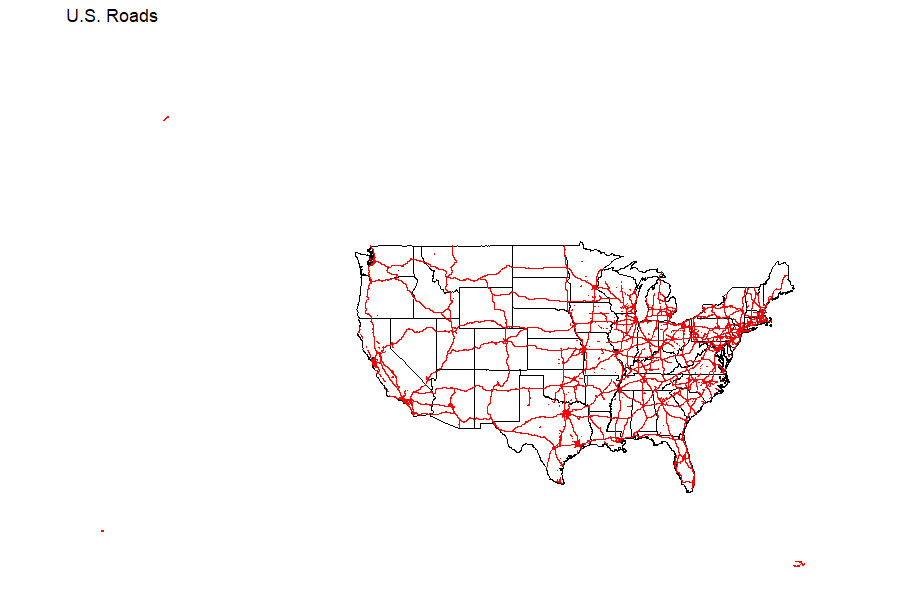

# [2023 30-Day Map Challenge](https://30daymapchallenge.com/)

## [Day 1: Points](day1-points.r)

Interactive map published on [RPubs](http://rpubs.com/jspayd/day1-points-30daymapchallenge2023)

**Data source**: Health Center Service Delivery and Look-Alike Sites, retrieved from [data.HRSA.gov](https://data.hrsa.gov/data/download?hmpgtitle=hmpg-hrsa-data) on November 3, 2023

## [Day 2: Lines](day2-lines.r)

**Data source**: U.S. Primary Roads, retrieved from [catalog.data.gov](https://catalog.data.gov/dataset/tiger-line-shapefile-2019-nation-u-s-primary-roads-national-shapefile) on November 7, 2023

## [Day 3: Polygons](day3-polygons.r)

**Data source**: Health Center Service Delivery and Look-Alike Sites, retrieved from [data.HRSA.gov](https://data.hrsa.gov/data/download?hmpgtitle=hmpg-hrsa-data) on November 3, 2023

## Day 4: A bad map

## Day 5: Analog

## Day 6: Asia

## [Day 7: Navigation](day7-navigation.r)

Interactive map published on [RPubs](http://rpubs.com/jspayd/day2-lines-30daymapchallenge2023)

**Data source**: DC Metro Lines Regional, retrieved from [opendata.dc.gov](https://opendata.dc.gov/datasets/DCGIS::metro-lines-regional/explore) on November 7, 2023

## Day 8: 